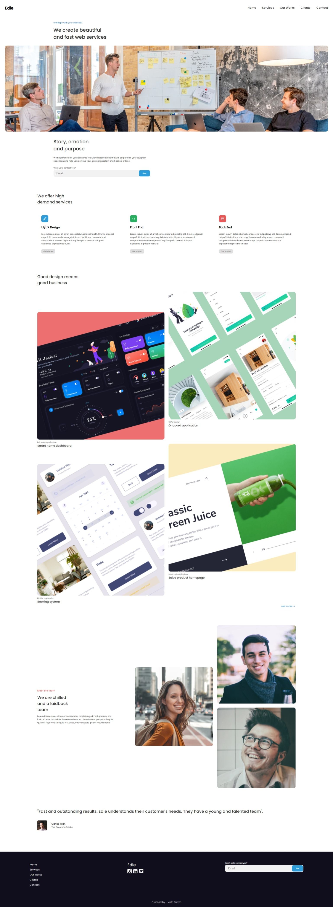
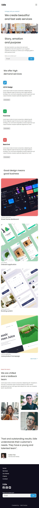

<h1 align="center">Edie Home Page</h1>

   Solution for a challenge from  <a href="http://devchallenges.io" target="_blank">Devchallenges.io</a>.

  <h3>
    <a href="https://vetri-suriya.web.app/devchallenges/edie-homepage/">Demo</a>
     | 
    <a href="https://github.com/vetrisuriya/edie-homepage">Solution</a>
     | 
    <a href="https://devchallenges.io/challenges/xobQBuf8zWWmiYMIAZe0">Challenge</a>
  </h3>

<!-- TABLE OF CONTENTS -->

## Table of Contents

- [Overview](#overview)
  - [Built With](#built-with)
- [Features](#features)
- [Contact](#contact)

## Overview

### Built With

- [HTML5](#!)
- [CSS3](#!)
- [Javascript](#!)
- [SASS](https://sass-lang.com/)

## Features

This application/site was created as a submission to a [DevChallenges](https://devchallenges.io/challenges) challenge. The [challenge](https://devchallenges.io/challenges/xobQBuf8zWWmiYMIAZe0) was to build an application to complete the following user stories:

## Contact

- Website [vetri-suriya](https://vetri-suriya.web.app/)
- GitHub [vetrisuriya](https://github.com/vetrisuriya)
- Linkedin [vetri-suriya](https://www.linkedin.com/in/vetri-suriya/)